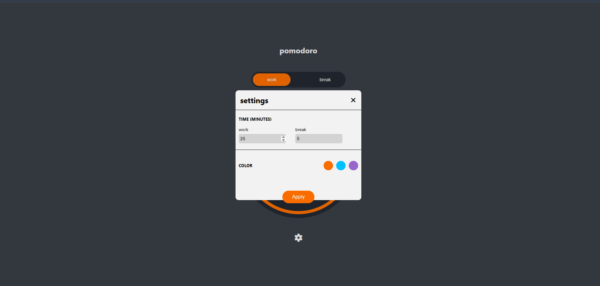
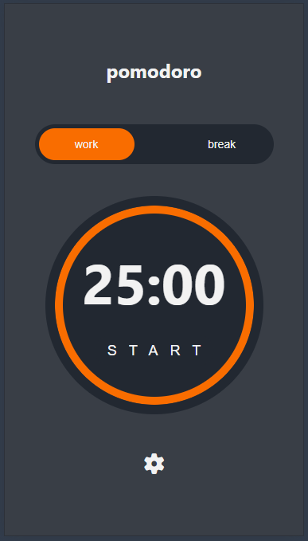
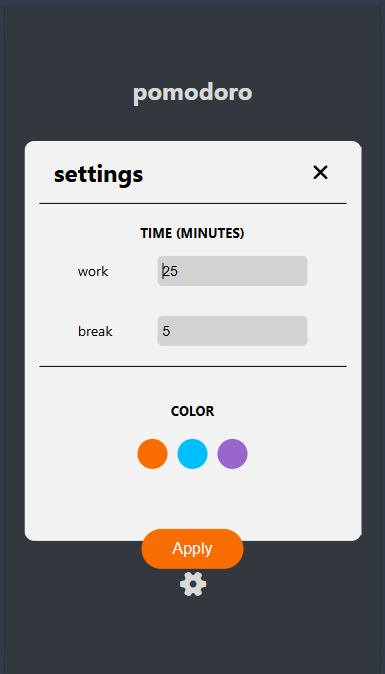

# ⏱️ Pomodoro Timer (JavaScript)

A simple, customizable **Pomodoro Timer** built with vanilla JavaScript.  
This project helps you stay productive by breaking work into focused intervals, separated by short breaks.

---

## 📖 Features
- 🎯 **Pomodoro Technique**: 25-minute focus sessions followed by 5-minute breaks
- 🔄 **Customizable**: Adjust work and break durations
- 🔔 **Notifications**: Alerts when a session ends
- 🎨 **Minimal UI**: Clean, distraction-free design
- 💾 **Persistence**: Saves your settings in local storage

---

